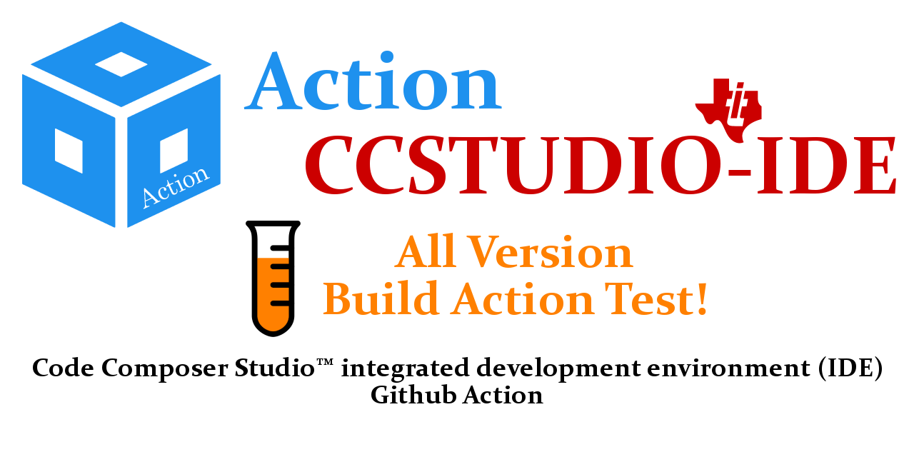

<!-- markdownlint-disable MD033 MD041 -->

  

  
  
  
  
  

<!-- markdownlint-enable MD033 MD041 -->

<!-- TEST_RESULTS_START -->

## Test Results

This table shows the build status for all tested CCS versions:

| CCS Version | Build Status | Configurations | Last Updated | Details |
|-------------|-------------|----------------|--------------|---------|
| v20.5.1.00012 |  | Debug, Release | - | [Workflow](https://github.com/uoohyo/action-ccstudio-ide-sample/actions/workflows/test-ccs-v20.5.1.00012.yml) |
| v20.5.0.00028 |  | Debug, Release | - | [Workflow](https://github.com/uoohyo/action-ccstudio-ide-sample/actions/workflows/test-ccs-v20.5.0.00028.yml) |
| v20.4.1.00004 |  | Debug, Release | - | [Workflow](https://github.com/uoohyo/action-ccstudio-ide-sample/actions/workflows/test-ccs-v20.4.1.00004.yml) |
| v20.4.0.00013 |  | Debug, Release | 2026-05-13 | [Logs](https://github.com/uoohyo/action-ccstudio-ide-sample/actions/runs/25808797501) |
| v20.3.1.00005 |  | Debug, Release | - | [Workflow](https://github.com/uoohyo/action-ccstudio-ide-sample/actions/workflows/test-ccs-v20.3.1.00005.yml) |
| v20.3.0.00014 |  | Debug, Release | - | [Workflow](https://github.com/uoohyo/action-ccstudio-ide-sample/actions/workflows/test-ccs-v20.3.0.00014.yml) |
| v20.2.0.00012 |  | Debug, Release | 2026-05-13 | [Logs](https://github.com/uoohyo/action-ccstudio-ide-sample/actions/runs/25808800689) |
| v20.1.1.00008 |  | Debug, Release | - | [Workflow](https://github.com/uoohyo/action-ccstudio-ide-sample/actions/workflows/test-ccs-v20.1.1.00008.yml) |
| v20.1.0.00006 |  | Debug, Release | 2026-05-13 | [Logs](https://github.com/uoohyo/action-ccstudio-ide-sample/actions/runs/25808800666) |
| v20.0.2.00005 |  | Debug, Release | - | [Workflow](https://github.com/uoohyo/action-ccstudio-ide-sample/actions/workflows/test-ccs-v20.0.2.00005.yml) |
| v20.0.1.00004 |  | Debug, Release | - | [Workflow](https://github.com/uoohyo/action-ccstudio-ide-sample/actions/workflows/test-ccs-v20.0.1.00004.yml) |
| v20.0.0.00012 |  | Debug, Release | - | [Workflow](https://github.com/uoohyo/action-ccstudio-ide-sample/actions/workflows/test-ccs-v20.0.0.00012.yml) |
| v12.8.1.00005 |  | Debug, Release | - | [Workflow](https://github.com/uoohyo/action-ccstudio-ide-sample/actions/workflows/test-ccs-v12.8.1.00005.yml) |
| v12.8.0.00012 |  | Debug, Release | - | [Workflow](https://github.com/uoohyo/action-ccstudio-ide-sample/actions/workflows/test-ccs-v12.8.0.00012.yml) |
| v12.7.1.00001 |  | Debug, Release | 2026-05-13 | [Logs](https://github.com/uoohyo/action-ccstudio-ide-sample/actions/runs/25808798150) |
| v12.7.0.00007 |  | Debug, Release | - | [Workflow](https://github.com/uoohyo/action-ccstudio-ide-sample/actions/workflows/test-ccs-v12.7.0.00007.yml) |
| v12.6.0.00008 |  | Debug, Release | - | [Workflow](https://github.com/uoohyo/action-ccstudio-ide-sample/actions/workflows/test-ccs-v12.6.0.00008.yml) |
| v12.5.0.00007 |  | Debug, Release | - | [Workflow](https://github.com/uoohyo/action-ccstudio-ide-sample/actions/workflows/test-ccs-v12.5.0.00007.yml) |
| v12.4.0.00007 |  | Debug, Release | - | [Workflow](https://github.com/uoohyo/action-ccstudio-ide-sample/actions/workflows/test-ccs-v12.4.0.00007.yml) |
| v12.3.0.00005 |  | Debug, Release | 2026-05-13 | [Logs](https://github.com/uoohyo/action-ccstudio-ide-sample/actions/runs/25808797898) |
| v12.2.0.00009 |  | Debug, Release | 2026-05-13 | [Logs](https://github.com/uoohyo/action-ccstudio-ide-sample/actions/runs/25808797948) |
| v12.1.0.00007 |  | Debug, Release | - | [Workflow](https://github.com/uoohyo/action-ccstudio-ide-sample/actions/workflows/test-ccs-v12.1.0.00007.yml) |
| v12.0.0.00009 |  | Debug, Release | - | [Workflow](https://github.com/uoohyo/action-ccstudio-ide-sample/actions/workflows/test-ccs-v12.0.0.00009.yml) |
| v11.2.0.00007 |  | Debug, Release | - | [Workflow](https://github.com/uoohyo/action-ccstudio-ide-sample/actions/workflows/test-ccs-v11.2.0.00007.yml) |
| v11.1.0.00011 |  | Debug, Release | - | [Workflow](https://github.com/uoohyo/action-ccstudio-ide-sample/actions/workflows/test-ccs-v11.1.0.00011.yml) |
| v11.0.0.00012 |  | Debug, Release | - | [Workflow](https://github.com/uoohyo/action-ccstudio-ide-sample/actions/workflows/test-ccs-v11.0.0.00012.yml) |
| v10.4.0.00006 |  | Debug, Release | - | [Workflow](https://github.com/uoohyo/action-ccstudio-ide-sample/actions/workflows/test-ccs-v10.4.0.00006.yml) |
| v10.3.1.00003 |  | Debug, Release | - | [Workflow](https://github.com/uoohyo/action-ccstudio-ide-sample/actions/workflows/test-ccs-v10.3.1.00003.yml) |
| v10.3.0.00007 |  | Debug, Release | 2026-05-13 | [Logs](https://github.com/uoohyo/action-ccstudio-ide-sample/actions/runs/25808798717) |
| v10.2.0.00009 |  | Debug, Release | - | [Workflow](https://github.com/uoohyo/action-ccstudio-ide-sample/actions/workflows/test-ccs-v10.2.0.00009.yml) |
| v10.1.1.00004 |  | Debug, Release | - | [Workflow](https://github.com/uoohyo/action-ccstudio-ide-sample/actions/workflows/test-ccs-v10.1.1.00004.yml) |
| v10.1.0.00010 |  | Debug, Release | - | [Workflow](https://github.com/uoohyo/action-ccstudio-ide-sample/actions/workflows/test-ccs-v10.1.0.00010.yml) |
| v10.0.0.00010 |  | Debug, Release | - | [Workflow](https://github.com/uoohyo/action-ccstudio-ide-sample/actions/workflows/test-ccs-v10.0.0.00010.yml) |
| v9.3.0.00012 |  | Debug, Release | 2026-05-13 | [Logs](https://github.com/uoohyo/action-ccstudio-ide-sample/actions/runs/25808798857) |
| v9.2.0.00013 |  | Debug, Release | - | [Workflow](https://github.com/uoohyo/action-ccstudio-ide-sample/actions/workflows/test-ccs-v9.2.0.00013.yml) |
| v9.1.0.00010 |  | Debug, Release | 2026-05-13 | [Logs](https://github.com/uoohyo/action-ccstudio-ide-sample/actions/runs/25808799677) |
| v9.0.1.00004 |  | Debug, Release | 2026-05-13 | [Logs](https://github.com/uoohyo/action-ccstudio-ide-sample/actions/runs/25808798185) |
| v9.0.0.00018 |  | Debug, Release | - | [Workflow](https://github.com/uoohyo/action-ccstudio-ide-sample/actions/workflows/test-ccs-v9.0.0.00018.yml) |
| v8.3.1.00004 |  | Debug, Release | - | [Workflow](https://github.com/uoohyo/action-ccstudio-ide-sample/actions/workflows/test-ccs-v8.3.1.00004.yml) |
| v8.3.0.00009 |  | Debug, Release | - | [Workflow](https://github.com/uoohyo/action-ccstudio-ide-sample/actions/workflows/test-ccs-v8.3.0.00009.yml) |
| v8.2.0.00007 |  | Debug, Release | - | [Workflow](https://github.com/uoohyo/action-ccstudio-ide-sample/actions/workflows/test-ccs-v8.2.0.00007.yml) |
| v8.1.0.00011 |  | Debug, Release | - | [Workflow](https://github.com/uoohyo/action-ccstudio-ide-sample/actions/workflows/test-ccs-v8.1.0.00011.yml) |
| v8.0.0.00016 |  | Debug, Release | - | [Workflow](https://github.com/uoohyo/action-ccstudio-ide-sample/actions/workflows/test-ccs-v8.0.0.00016.yml) |
| v7.4.0.00015 |  | Debug, Release | - | [Workflow](https://github.com/uoohyo/action-ccstudio-ide-sample/actions/workflows/test-ccs-v7.4.0.00015.yml) |
| v7.3.0.00019 |  | Debug, Release | - | [Workflow](https://github.com/uoohyo/action-ccstudio-ide-sample/actions/workflows/test-ccs-v7.3.0.00019.yml) |
| v7.2.0.00013 |  | Debug, Release | - | [Workflow](https://github.com/uoohyo/action-ccstudio-ide-sample/actions/workflows/test-ccs-v7.2.0.00013.yml) |
| v7.1.0.00016 |  | Debug, Release | - | [Workflow](https://github.com/uoohyo/action-ccstudio-ide-sample/actions/workflows/test-ccs-v7.1.0.00016.yml) |
| v7.0.0.00043 |  | Debug, Release | - | [Workflow](https://github.com/uoohyo/action-ccstudio-ide-sample/actions/workflows/test-ccs-v7.0.0.00043.yml) |

<!-- TEST_RESULTS_END -->

This repository provides **comprehensive compatibility testing** for the [uoohyo/action-ccstudio-ide](https://github.com/marketplace/actions/build-with-code-composer-studio-integrated-development-environment-ide) GitHub Action across all released versions.

## Purpose

Automatically verify that action-ccstudio-ide works correctly across various versions of Code Composer Studio (CCS). When new CCS versions are released, test projects are automatically generated and build tests are performed.

## Key Features

- **Automated Version Discovery**: Automatically detect new CCS versions via GitHub Releases API
- **Auto-Generate Projects**: Automatically create test projects for missing versions using Docker + CCS CLI
- **Comprehensive Testing**: Coverage of 48+ CCS versions (v7.0.0 ~ v20.5.1)
- **Continuous Integration**: Automatic build testing for all versions on push to main branch
- **Real-Time Status Dashboard**: Check build status for each version in the table below

## Target Configuration

- **Device**: TMS320F28335 (C2000 family DSP)
- **Manufacturer**: Texas Instruments Inc.
- **Output Format**: COFF
- **Build Configurations**: Debug, Release
- **Memory Mode**: RAM-based (using 28335_RAM_lnk.cmd)

## License

[MIT License](./LICENSE)

Copyright (c) 2024-2026 [uoohyo](https://github.com/uoohyo)

Permission is hereby granted, free of charge, to any person obtaining a copy
of this software and associated documentation files (the "Software"), to deal
in the Software without restriction, including without limitation the rights
to use, copy, modify, merge, publish, distribute, sublicense, and/or sell
copies of the Software, and to permit persons to whom the Software is
furnished to do so, subject to the following conditions:

The above copyright notice and this permission notice shall be included in all
copies or substantial portions of the Software.

THE SOFTWARE IS PROVIDED "AS IS", WITHOUT WARRANTY OF ANY KIND, EXPRESS OR
IMPLIED, INCLUDING BUT NOT LIMITED TO THE WARRANTIES OF MERCHANTABILITY,
FITNESS FOR A PARTICULAR PURPOSE AND NONINFRINGEMENT. IN NO EVENT SHALL THE
AUTHORS OR COPYRIGHT HOLDERS BE LIABLE FOR ANY CLAIM, DAMAGES OR OTHER
LIABILITY, WHETHER IN AN ACTION OF CONTRACT, TORT OR OTHERWISE, ARISING FROM,
OUT OF OR IN CONNECTION WITH THE SOFTWARE OR THE USE OR OTHER DEALINGS IN THE
SOFTWARE.
